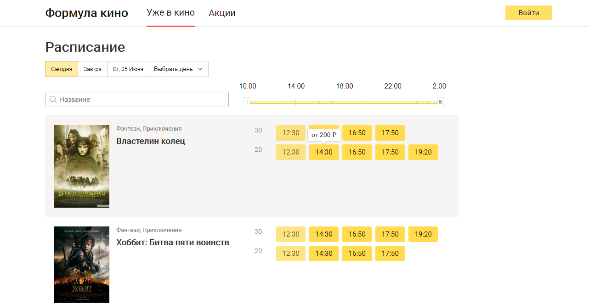
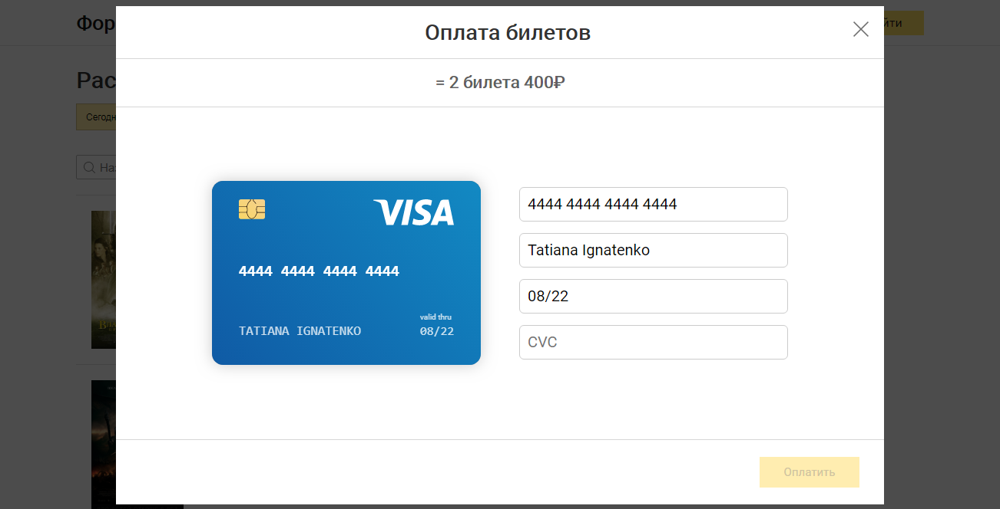

# Cinema app [Frontend]

Simplified Yandex.Afisha clone

**[DEMO](https://tanyaignatenko.github.io/cinema-app/)**

An application for viewing cinema schedules and purchasing tickets.

## Screenshots :camera:






## Development
```
npm i
npm start
```
